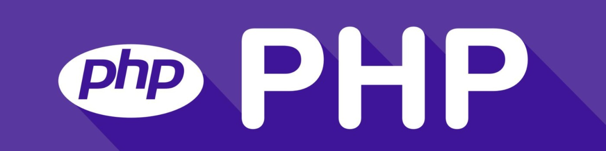

# 👋 Hi there! I'm Péter Muladi
## 🎯 Founder & Backend Developer at Netpro Web Development™

As a passionate backend developer, I specialize in building custom, scalable web applications using PHP, Laravel, MySQL, and other cutting-edge technologies. My mission is to deliver high-performance, user-friendly solutions that empower businesses to succeed online.

## 🛠 Technologies & Tools
- **Languages:** PHP, JavaScript, SQL
- **Frameworks:** Laravel, Bootstrap
- **Databases:** MySQL
- **Tools & Platforms:** Git, GitHub, Composer, Postman
- **Architectures & Patterns:** REST API, MVC, OOP

## 🚀 What I Do at Netpro Web Development™
At [Netpro Web Development™](https://www.netpro.hu), I focus on:
- **Custom Laravel Applications:** Developing tailored web solutions that meet specific business needs.
- **RESTful APIs:** Designing and implementing robust APIs for seamless client-server communication.
- **Scalable Solutions:** Ensuring that all applications are built with scalability and performance in mind.
- **User-Centered Design:** Prioritizing user experience in every aspect of development.

## 🌍 Let's Connect!
- **Website:** [www.netpro.hu](https://www.netpro.hu)
- **LinkedIn:** [in/petermuladi](https://www.linkedin.com/in/petermuladi)
- **Email:** [info@netpro.hu](mailto:info@netpro.hu)

I'm always open to new opportunities and collaborations. If you're looking to take your business to the next level with innovative web solutions, feel free to reach out!
