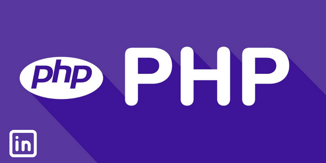

# 🖐Hi there! 

I'm Péter Muladi, a junior web developer with a passion for creating efficient and user-friendly web applications. As a recent graduate of Ruander Oktatási Kft. I bring a fresh perspective and a strong foundation in **PHP**, **MySQL**, **SQL**, **JavaScript**, **React**, **Bootstrap**, **REST API**, **OOP**, and **MVC** to my work.

My experience in backend development has taught me to approach complex problems with creativity and attention to detail, while my dedication to continuous learning keeps me up-to-date with the latest web development trends and technologies.

I am currently seeking opportunities to utilize my skills and contribute to a dynamic and innovative team. If you're looking for a dedicated web developer who can deliver high-quality results, please don't hesitate to contact me. Let's build something great together!

🎯**Skills**: - Relational Databases · DOM Manipulation · SOLID Principles · JSON · PHP · React.js · XAMPP · REST APIs · Analytical Skills · Problem Solving · Model-View-Controller (MVC) · Object-Oriented Programming (OOP) · MySQL · PhpMyAdmin · Bootstrap · JavaScript · Cascading Style Sheets (CSS) · HTML
